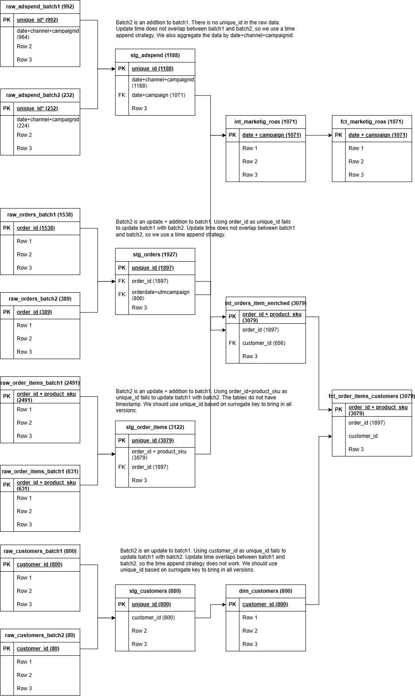

# aemastery-capstone
This is the AE mastery course capstone project.  
This project pulls four data sources to answer two questions: 1. What is the sales performance? 2. What is the impact of marketing spend on revenue?  
Below is the datat model diagram.  
 

The project creates two fact tables that can be used for data analysis and for dashboard monitoring. See dashboard [here](https://lookerstudio.google.com/s/iqMdn-shzVg).
