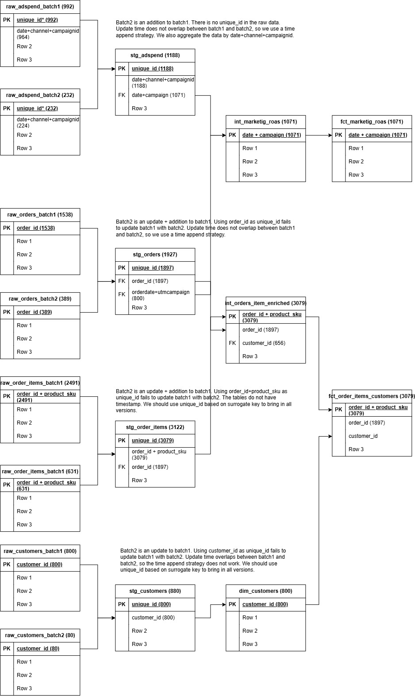

# Revenue and Marketing Performance Capstone Project

## Business Problem
The CTO of a small e-commerce company wants to develop the analytics foundation, answering questions about revenue, customer growth, and marketing performance. The two key questions to answer are: 1. What is the sales performance? 2. What is the impact of marketing spend on revenue?  

## Data
The project involves four primary data sources, ads pend, orders, order items, and customers. The goal is to combine, transform, and aggregate these data sources into clean, usable tables to answer the business questions.  
Data modeling is performed on **dbt Cloud**, and data outputs are stored on **Google BigQuery**. The final tables (mart tables) are presented on a **Google Studio** dashboard.  
Caveat: A free version of Google BigQuery is used in this project, so transformations, such as incremental materialization and snapshot, that involve DML queries (queries to update, insert, and delete data from big query tables) are performed in a suboptimal manner. The data lineage shows what is performed under **Actual** and what could be done under **Ideal**. 

Below is the data model diagram.  
 

The project creates two fact tables that can be used for data analysis and for dashboard monitoring. See dashboard [here](https://lookerstudio.google.com/s/iqMdn-shzVg).
